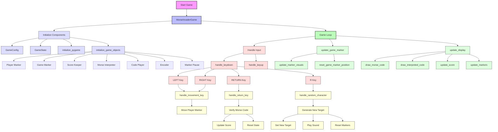

# Technical Diagrams

This document contains the technical diagrams representing the Morse Invader game architecture and flows.

## Application Flow Diagram



### Color Legend

- 🟣 Pink (Main Entry Points): Primary system entry points
- 🔵 Light Blue (Initialization): System initialization processes
- 🔴 Light Red (Input): Input handling processes
- 🟢 Light Green (Updates): State update processes
- 🟡 Light Yellow (Actions): Game actions and responses

### Flow Description

1. **Initialization Phase**
   - Game starts and initializes core components
   - Sets up configuration and game state
   - Initializes PyGame and game objects

2. **Game Loop Phase**
   - Handles continuous input processing
   - Updates game marker positions
   - Manages display updates
   - Processes game logic

3. **Input Processing**
   - Processes keyboard inputs (LEFT, RIGHT, RETURN, R)
   - Triggers appropriate game actions
   - Updates game state based on input

4. **Update Phase**
   - Updates marker positions
   - Updates visual elements
   - Updates game state
   - Updates display

5. **Action Phase**
   - Executes game actions based on input
   - Updates scores
   - Resets states as needed
   - Generates new targets

## Source Code

The source for these diagrams is maintained in the Mermaid format. To modify these diagrams:

1. Edit the Mermaid code within the ```mermaid blocks
2. Preview changes using the Mermaid Live Editor: [https://mermaid.live](https://mermaid.live)
3. Update this document with the verified changes

For more complex changes, consider using the Mermaid CLI:
```bash
mmdc -i diagrams.md -o output.png
```