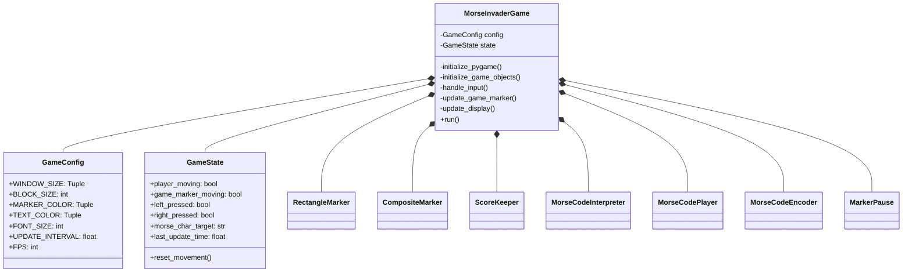
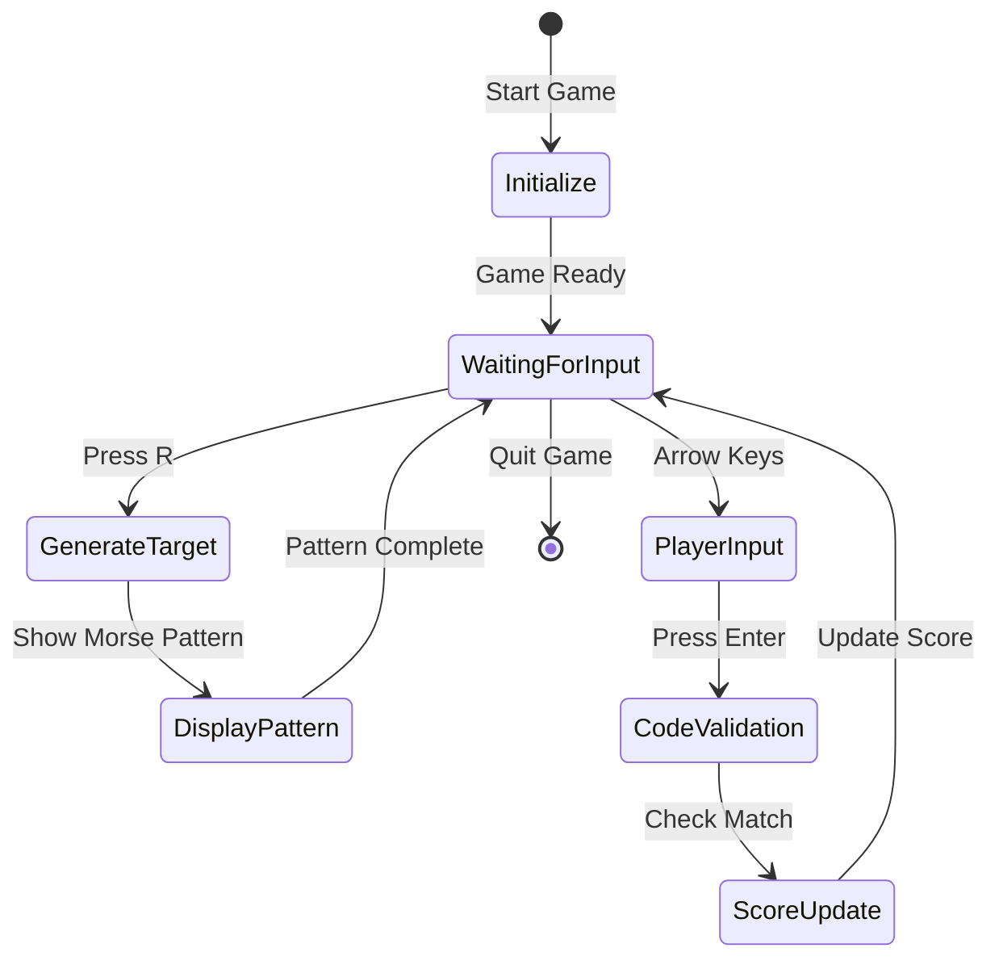
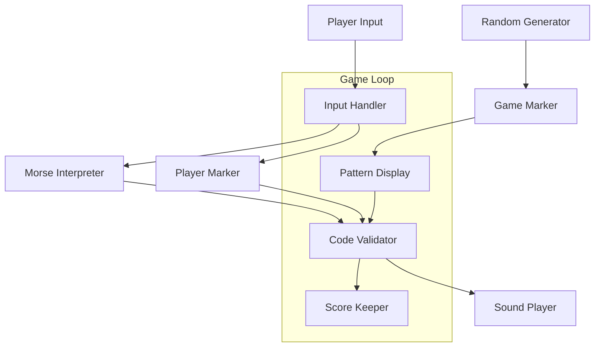

# Morse Invader Game

A Python-based educational game that helps players learn Morse code through an interactive space-invader style interface.

## Table of Contents
- [Overview](#overview)
- [Architecture](#architecture)
  - [Class Structure](#class-structure)
  - [Game Flow](#game-flow)
  - [Component Interaction](#component-interaction)
- [Installation](#installation)
- [Game Components](#game-components)
- [How to Play](#how-to-play)
- [Configuration](#configuration)
- [Class Documentation](#class-documentation)

## Overview

Morse Invader is an educational game that combines classic arcade-style gameplay with Morse code learning. Players must match Morse code patterns displayed by a moving marker, making it an engaging way to learn and practice Morse code.

## Architecture

### Class Structure



### Game Flow



### Component Interaction



## Installation

1. Clone the repository:
```bash
git clone https://github.com/yourusername/morse-invader.git
cd morse-invader
```

2. Install dependencies:
```bash
pip install pygame
```

3. Run the game:
```bash
python morse_invader.py
```

## Game Components

The game consists of several key components:

- **Player Marker**: A controllable marker that players use to input Morse code
- **Game Marker**: An automated marker that displays the target Morse code pattern
- **Score System**: Tracks correct and incorrect attempts
- **Morse Code Interpreter**: Converts player inputs into Morse code and validates them
- **Sound System**: Provides audio feedback for Morse code patterns

## How to Play

1. Press `R` to generate a random character target
2. Use `LEFT` and `RIGHT` arrow keys to create Morse code patterns:
   - `LEFT` for dots (.)
   - `RIGHT` for dashes (-)
3. Press `ENTER` to submit your answer
4. Match the pattern shown by the game marker to score points

## Configuration

The game's behavior can be customized through the `GameConfig` class:

```python
WINDOW_SIZE: (800, 600)    # Game window dimensions
BLOCK_SIZE: 25            # Size of game blocks
UPDATE_INTERVAL: 0.5      # Time between marker updates (seconds)
FPS: 30                   # Frames per second
```

## Class Documentation

### GameConfig

```python
@dataclass
class GameConfig:
```
Stores game configuration settings including window size, colors, and timing parameters.

#### Attributes
- `WINDOW_SIZE`: Tuple[int, int] - Window dimensions (width, height)
- `BLOCK_SIZE`: int - Size of game blocks
- `MARKER_COLOR`: Tuple[int, int, int] - RGB color for markers
- `TEXT_COLOR`: Tuple[int, int, int] - RGB color for text
- `FONT_SIZE`: int - Size of game font
- `UPDATE_INTERVAL`: float - Time between updates
- `FPS`: int - Frames per second

### GameState

```python
class GameState:
```
Manages the current state of the game.

#### Methods
- `__init__()`: Initializes game state variables
- `reset_movement()`: Resets all movement-related states

#### Attributes
- `player_moving`: bool - Indicates if player marker is moving
- `game_marker_moving`: bool - Indicates if game marker is moving
- `left_pressed`: bool - Left arrow key state
- `right_pressed`: bool - Right arrow key state
- `morse_char_target`: str - Current target character
- `last_update_time`: float - Timestamp of last update

### MorseInvaderGame

```python
class MorseInvaderGame:
```
Main game class that coordinates all game components and handles the game loop.

#### Key Methods
- `initialize_pygame()`: Sets up Pygame environment
- `initialize_game_objects()`: Creates game objects
- `handle_input()`: Processes user input
- `update_game_marker()`: Updates game marker position
- `update_display()`: Refreshes game display
- `run()`: Main game loop
