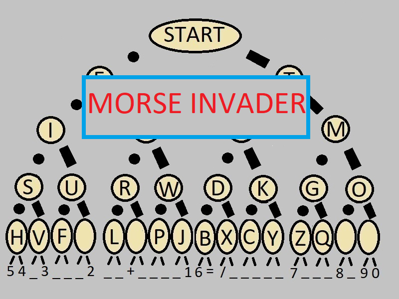

# Morse Invader Python Game



## Description

Morse Invader is a Python Game designed to help the player learn to hear and recognize morse code symbols by playing a game,
where all the symbols are layed out in a binary seach tree to promote easier visualization and recall without rote memorization. 
In this game the symbols are played in random ordrer and the player learns to recognize and reproduce them while the game
keeps track of hits and misses. The binary search tree is five layers deep and currently includes north american alphabetic and 
numeric codes plus a few more. The design of this game was loosely inspired by Space Invaders, hence the name.   

## Features

- Pressing 'R' plays a random morse code symbol that challenges the player to recreate the dots and dashes they just heard. 
- The selected random character is displayed on the right as 'Target Char'
- Pressing 'Enter' causes the game to play back the dot and dash sounds for each (valid) symbol that the has player entered.
- Non morse code symbols are flagged with Red Text and the errant dot dash symbol is shown
- The game scores each player entry as hit or miss depending on whether the players symbol matches the random symbol
- The game displays a record of hits and misses 

## Installation

1. Ensure you have Python 3.11+ installed on your system.
2. Clone this repository:
   ```
   git clone https://github.com/rainmaker1618033/morse_invader.git
   ```
3. Navigate to the project directory:
   ```
   cd /morse_invader
   ```
4. Install the required dependencies:
   ```
   pip install -r requirements.txt
   ```

## Building the Executable

1. To build the executable, follow these steps:
   ```
   pip install pyinstaller
   ```
2. Run the following commands to generate the executable:
   ```
   cd ~\src
   pyinstaller --onefile --add-data "assets:assets/images" --icon=icon.ico MORSE_INVADER.py
   ```
3. The executable will be generated in the /dist folder.

4. Copy ~/src/assets/images/background.jpg to ~/dist/assets/images/background.jpg

5. Run the executable:
   ```
   ./dist/morse_invader.exe
   ```

## Executable File in /dist

The `/dist` folder contains a pre-built executable file for convenience. This file is generated from the Python script using PyInstaller and is meant for Windows 10 (x86) computers.

### Considerations:
- The executable may not run on other platforms (e.g., Linux, macOS).
- Users may prefer to build the executable themselves using the instructions in the "Building the Executable" section.

If you want to create the executable yourself, follow the steps provided in the [Building the Executable](#building-the-executable) section.


## How to Play

1. Run the game:
   ```
   python MORSE_INVADER.py
   ```
2. Press 'R' to hear a random morse code symbol.  'R' creates a target char to try and match
3. Use arrow keys to move the cursor left or right to match the random sysmbol
4. When you think you've entered the character completely, hit Enter to check the result and also to hear the symbol you entered.

## Controls

- ← → : Move left/right
- ENTER: Play whatever symbol has been entered using the left/right arrow keys
- R : Play a random character
- [X] : Close the game window

## Known Bugs

- The cursor will rarely move to an undefined position when an arrow key is pressed. Workaround is to hit 'Enter' and the cursor will return to its normal starting position.

## Future Enhancements

- Adjustable dot/dash playback speed for morse code symbols.
- Use 'S' to show the Target Character, else hide it by displaying '---' instead
- Three leter mode to generate three random characters in sequence and allow player to enter same three letters before scoring result as hit or miss. 
- International Character Version
- Add a second marker which moves from start to target char after the 'R' key plays the dot dash sounds. The player tries to move their cursor to the target first to win. 

## Contributing

Contributions are welcome! Please feel free to submit a Pull Request.

## License

This project is licensed under the MIT License - see the [LICENSE](LICENSE) file for details.

## Acknowledgments

- Dot Dash sound effects thanks to Pyadio.
- Game Engine thanks to the Pygame community.
- Selected algorithms originated by ChatGPT and integrated by author.
- Background Art inspired by: https://ia.m.wikipedia.org/wiki/File:Morse-code-tree.svg
- Game concept and balance of the code created by the author.

